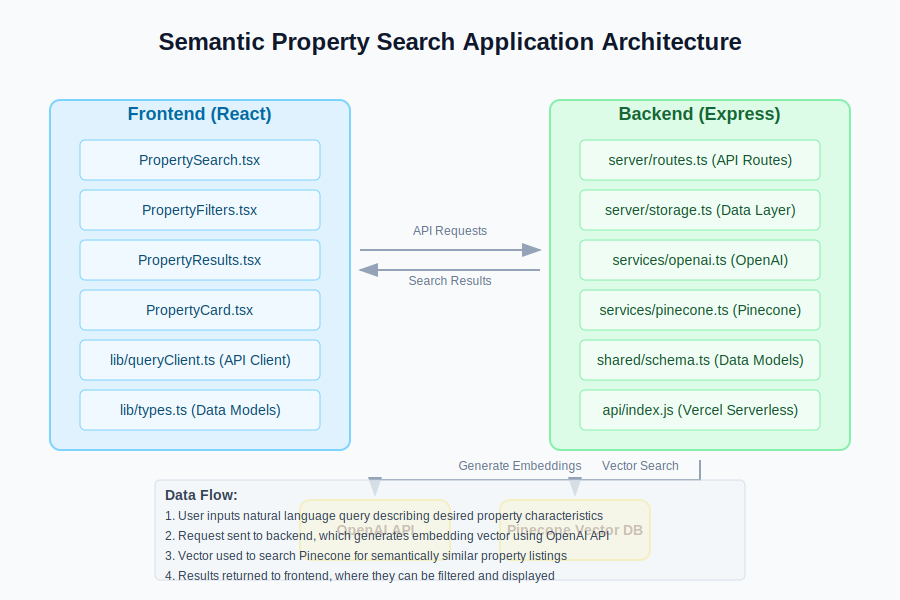

# Semantic Property Search - Architecture Documentation

## Overview

This application provides a semantic property search platform that allows users to search for real estate properties using natural language queries instead of traditional keyword-based search. It uses advanced AI techniques (embedding vectors) to understand the meaning behind search queries and find semantically similar properties.

## Components

### Frontend (React)

The frontend is built with React and utilizes modern UI components for an intuitive user experience.

#### Key Components

1. **PropertySearch.tsx**: The main component that orchestrates the search experience. It:
   - Handles user input for natural language queries
   - Presents sample search queries
   - Manages API communication with the backend
   - Handles API key errors gracefully
   
2. **PropertyFilters.tsx**: Provides filtering capabilities for search results:
   - Filter by property type, style, location
   - Filter by ranges (bedrooms, bathrooms, price)
   - Toggle filters on/off
   
3. **PropertyResults.tsx**: Displays search results in a clean, organized layout:
   - Shows loading states during search
   - Displays empty states when no results are found
   - Renders a collection of PropertyCard components
   
4. **PropertyCard.tsx**: Displays individual property listings:
   - Shows property details (title, location, price, etc.)
   - Presents relevant property attributes
   - Displays semantic match score

#### Utility Components

- **lib/queryClient.ts**: Manages API communication using TanStack Query
- **lib/types.ts**: Defines TypeScript interfaces for the application data models

### Backend (Express)

The backend is built with Express and provides API endpoints for property search and filtering.

#### Key Components

1. **server/routes.ts**: Defines the API routes:
   - `GET /api/property/filters`: Returns available filter options
   - `POST /api/property/search`: Processes natural language search queries
   - Handles API key validation and error responses
   
2. **server/storage.ts**: Manages the data layer:
   - Loads property data from CSV
   - Provides in-memory data storage
   - Generates filter options based on available data
   
3. **services/openai.ts**: Integrates with OpenAI API:
   - Generates embedding vectors for property data
   - Converts user queries to embedding vectors for search
   - Handles OpenAI API key validation
   
4. **services/pinecone.ts**: Integrates with Pinecone vector database:
   - Stores property embedding vectors
   - Performs semantic similarity search
   - Handles Pinecone API key validation
   
5. **shared/schema.ts**: Defines shared data models between frontend and backend
   - Property listing schemas
   - User schemas
   - Search result schemas
   
6. **api/index.js**: Serverless function entry point for Vercel deployment

### External Services

1. **OpenAI API**: Used for generating embedding vectors from text
   - Converts property descriptions to numerical vectors
   - Converts user queries to vectors in the same vector space
   
2. **Pinecone Vector Database**: Used for efficient vector similarity search
   - Stores property embedding vectors
   - Performs fast similarity search to find properties matching a query vector

## Data Flow

1. **Initialization**:
   - On application startup, the backend loads property listings from the CSV file
   - For each property, an embedding vector is generated using OpenAI
   - These vectors are stored in the Pinecone vector database

2. **Search Process**:
   - User enters a natural language query (e.g., "modern house with a garden view")
   - Frontend sends the query to the backend
   - Backend generates an embedding vector for the query using OpenAI
   - Backend searches the Pinecone database for similar vectors (properties)
   - Backend retrieves full property details for the matching IDs
   - Results are returned to the frontend, sorted by similarity score

3. **Filtering**:
   - User can apply filters to narrow down search results
   - Filtering is performed client-side on the already returned results
   - Filters are reset when a new search is performed

## Deployment

The application is configured for deployment on Vercel:

1. **Frontend**: Built with Vite and deployed as static assets
2. **Backend**: Deployed as serverless functions
3. **Environment Variables**: Required for API keys
   - `OPENAI_API_KEY`: For embedding generation
   - `PINECONE_API_KEY`: For vector database access
   - `PINECONE_INDEX_NAME`: For specifying the Pinecone index

## Error Handling

The application includes robust error handling:

1. **API Key Validation**:
   - Checks for missing or invalid API keys
   - Provides user-friendly error messages
   - Offers guidance on how to resolve API key issues

2. **Search Errors**:
   - Handles errors during the search process
   - Displays appropriate error messages to the user
   - Logs detailed error information for debugging

3. **Data Loading**:
   - Gracefully handles missing or corrupted data sources
   - Falls back to mock data when necessary
   - Logs data loading issues for troubleshooting